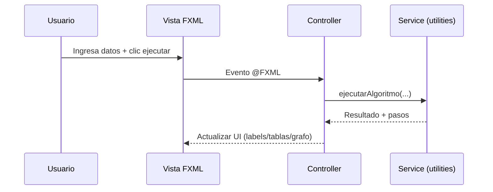
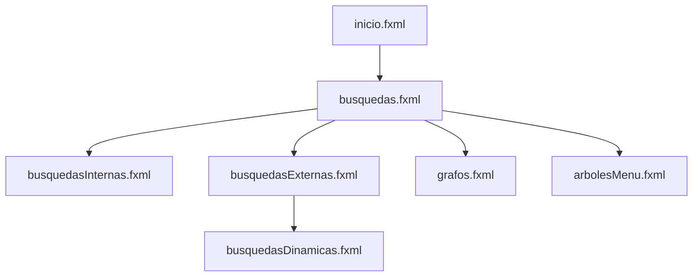

# 1. PORTADA

**Proyecto:** AppCiencias2  
**Manual técnico:** Arquitectura, implementación y operación  
**Autor(es):** No especificado en el repositorio (completar por el equipo).  
**Universidad:** No especificada en el repositorio (completar).  
**Carrera:** No especificada en el repositorio (completar).  
**Curso:** No especificado en el repositorio (completar).  
**Fecha:** 24 de mayo de 2026.

---

# 2. INTRODUCCIÓN

Este proyecto implementa una aplicación de escritorio JavaFX orientada al aprendizaje práctico de estructuras de datos y algoritmos clásicos: búsquedas internas/externas, hashing, árboles y teoría de grafos. La solución sigue un enfoque **MVC adaptado a JavaFX** con navegación por paneles FXML administrada por un controlador de layout central.

El objetivo funcional es ofrecer módulos visuales para:
- búsquedas lineales y binarias,
- funciones hash internas y externas,
- índices (primario, secundario y multinivel),
- representación y operaciones de grafos,
- caminos mínimos (Dijkstra, Bellman y Floyd),
- árbol generador (Kruskal),
- teoría de color,
- árboles digitales, tries, residuos múltiples y Huffman.

Tecnológicamente, el proyecto está construido con **Java 21 + JavaFX 21.0.2 + Maven**.

---

# 3. REQUISITOS DEL SISTEMA

## 3.1 Requisitos de software

| Componente | Requisito detectado | Evidencia técnica |
|---|---|---|
| JDK | Java 21 | `maven.compiler.source/target=21` en `pom.xml` |
| JavaFX | 21.0.2 | propiedad `javafx.version` |
| Build tool | Maven | `pom.xml` con `javafx-maven-plugin` |
| Dependencias JavaFX | base, graphics, controls, fxml, media | sección `<dependencies>` |
| OS objetivo de binarios JavaFX | Windows (`classifier=win`) | propiedad `javafx.platform` |

## 3.2 Dependencias principales

```xml
org.openjfx:javafx-base
org.openjfx:javafx-graphics
org.openjfx:javafx-controls
org.openjfx:javafx-fxml
org.openjfx:javafx-media
```

## 3.3 Herramientas recomendadas

- IDE Java con soporte Maven/JavaFX (IntelliJ IDEA, NetBeans, Eclipse).
- Git para control de versiones.
- Maven 3.9+.

---

# 4. INSTALACIÓN E INICIALIZACIÓN

## 4.1 Clonado del repositorio

```bash
git clone <URL_DEL_REPOSITORIO>
cd Proyecto-Ciencias-de-la-computacion-2/AppCiencias2
```

## 4.2 Compilación

```bash
mvn clean compile
```

## 4.3 Ejecución

```bash
mvn javafx:run
```

## 4.4 Empaquetado

```bash
mvn clean package
```

## 4.5 Notas de configuración

- El `mainClass` está configurado como `application.App`.
- El arranque carga `layout.fxml` como contenedor raíz y `inicio.fxml` como panel inicial.
- Si se ejecuta fuera de Windows, ajustar `javafx.platform` en `pom.xml` (`linux`/`mac`).

---

# 5. ARQUITECTURA DEL PROYECTO

## 5.1 Patrón arquitectónico

El proyecto implementa una arquitectura **MVC** con estas capas:

- **Modelo/Lógica:** clases en `utilities` (estructuras, servicios, algoritmos).
- **Vista:** FXML + CSS en `src/main/resources`.
- **Controlador:** clases en `controller` que capturan eventos JavaFX y coordinan servicios.

## 5.2 Flujo MVC general


## 5.3 Navegación centralizada

`LayoutController` actúa como orquestador: carga paneles FXML dinámicamente, inyecta referencias de layout en controladores, y mantiene historial para `goBack`.

```mermaid
flowchart TD
  A[App.start] --> B[layout.fxml]
  B --> C[LayoutController]
  C --> D[inicio.fxml]
  C --> E[loadPanel('/modulo.fxml')]
  E --> F[FXMLLoader + Controller del módulo]
  F --> G[setLayoutController(this)]
  G --> H[contentPane.setAll(panel)]
```

---

# 6. ESTRUCTURA DE DIRECTORIOS Y PAQUETES

## 6.1 Estructura principal

| Ruta | Tipo | Propósito |
|---|---|---|
| `AppCiencias2/src/main/java/application` | Código | Punto de entrada (`App`) |
| `AppCiencias2/src/main/java/controller` | Código | Controladores JavaFX por módulo |
| `AppCiencias2/src/main/java/utilities` | Código | Modelos, servicios y algoritmos |
| `AppCiencias2/src/main/resources` | Recursos | Vistas FXML, íconos e `styles.css` |
| `AppCiencias2/pom.xml` | Build | Dependencias y plugin JavaFX |

## 6.2 Controladores detectados (resumen)

- Navegación/UI: `LayoutController`, `MenuController`, `InicioController`.
- Búsquedas: `BusquedaController`, `BusquedasInternasController`, `BusquedasExternasController`, `BusquedaLinealController`, `BusquedaBinariaController`, `BusquedaHashController`, `BusquedaHashExternaController`, `BusquedaExpTotalesController`, `BusquedaExpParcialesController`.
- Índices: `IndicesExternosController`, `IndicePrimarioController`, `IndiceSecundarioController`, `IndiceMultinivelController`.
- Grafos: `GrafosController`, `RepresentacionGrafosController`, `OperacionesGrafosController`, `CaminosMinimosController`, `ArbolGeneradorController`, `TeoriaColorController`, `AlgoritmosGrafosController`, `MenuRepresentacionMetricasController`, `DistanciaVerticesController`.
- Árboles y codificación: `ArbolesController`, `ArbolesMenuController`, `ArbolDigitalController`, `ResiduosMultiplesController`, `TriesResiduosController`, `HuffmanController`, `DistanciaArbolesController`, `FuncionOrdinalController`.

## 6.3 Vistas FXML relevantes

`layout.fxml`, `menu.fxml`, `inicio.fxml`, `busquedas.fxml`, `busquedasInternas.fxml`, `busquedasExternas.fxml`, `busquedaLineal.fxml`, `busquedaBinaria.fxml`, `busquedaHash.fxml`, `busquedaHashExterna.fxml`, `busquedaExpTotales.fxml`, `busquedaExpParciales.fxml`, `indicesExternos.fxml`, `IndicePrimario.fxml`, `IndiceSecundario.fxml`, `IndiceMultinivel.fxml`, `grafos.fxml`, `representacionGrafos.fxml`, `operaciones.fxml`, `caminosMinimos.fxml`, `arbolGenerador.fxml`, `teoriaColor.fxml`, `arbolesMenu.fxml`, `arbolSimple.fxml`, `arbolDigital.fxml`, `residuosMultiples.fxml`, `tresResiduos.fxml`, `huffman.fxml`, `funcionOrdinal.fxml`, `distanciaArboles.fxml`, `distanciaVertices.fxml`, `menuRepresentacionMetricas.fxml`.

---

# 7. MÓDULOS TÉCNICOS Y LÓGICA

## 7.1 Módulo de navegación

- `App` inicia la aplicación y configura la escena principal.
- `LayoutController` administra:
  - carga de paneles (`loadPanel`),
  - historial (`Deque<Node> history`),
  - botón de retorno,
  - menú lateral embebido.
- `MenuController` concentra la navegación jerárquica con submenús y carga de FXML por evento.

## 7.2 Módulo de grafos

### Entidades y estructuras
- `Grafo`, `Vertice`, `Arista` para grafos generales.
- `GrafoPonderado` y `AristaPonderada` para escenarios con peso.
- `UnionFind` para conectividad y Kruskal.

### Operaciones implementadas
En `Grafo` se observan operaciones de teoría de conjuntos y transformaciones:
- unión,
- intersección,
- suma anular,
- complemento,
- suma normal,
- fusión de vértices,
- además de coloreado en lógica del mismo módulo.

### Representaciones matriciales
`MatrizGrafosService` construye:
- matriz de adyacencia,
- matriz de incidencia,
- matriz de adyacencia de aristas.

## 7.3 Módulo de caminos mínimos

`CaminosMinimosService` implementa:
- `ejecutarBellmanOrdinal(...)`,
- `ejecutarDijkstra(...)`,
- `ejecutarFloyd(...)`.

Cada algoritmo produce detalle paso a paso y salida estructurada en `ResultadoCaminoMinimo`.

## 7.4 Módulo de árbol generador mínimo/máximo

`ArbolGeneradorService` implementa Kruskal:
- `kruskal(...)`,
- `kruskalConDetalle(...)`.

`ArbolGeneradorController` consume el resultado detallado para visualización del proceso.

## 7.5 Módulo de hashing y búsquedas

- Hash interno: `BusquedaHashController`, `SlotHash`, archivos `.hash`, opciones de hash y colisiones.
- Hash externo: `BusquedaHashExternaController`, `SlotHashExterno`, `SlotCubeta`, persistencia de estructura externa.
- Expansión total/parcial: `HashExpTotales`, `HashExpParciales` con rutinas de rehash.
- Búsqueda lineal: `BusquedaLinealService` + controlador de interacción.

## 7.6 Módulo de árboles y codificación

- Árbol genérico/básico: `Arbol`, `NodoArbol`, `ArbolVisual`.
- Árbol digital / tries / residuos múltiples: controladores y clases como `NodoMulti`, `ArbolResiduosMultiples`.
- Huffman: `NodoHuffman`, `CodigoLetra`, `HuffmanController`.
- Distancia/ordinal: `DistanciaArbolesService`, `FuncionOrdinalService`.

## 7.7 Persistencia utilitaria

- `ArchivoEstructuraService` y `GestorArchivos` para guardado/carga de estructuras.
- `DatosArchivo`, `RegistroDato`, `SlotIndice`, `SlotClave` para soporte de índices/estructuras.

---

# 8. FLUJO DE DATOS E INTERACCIÓN

## 8.1 Flujo de interacción de usuario

1. Usuario acciona botón/menu en una vista FXML.
2. Controlador captura evento `@FXML`.
3. Controlador valida entradas y llama a servicio de `utilities`.
4. Servicio procesa algoritmo/estructura y retorna resultados.
5. Controlador actualiza labels, tablas, paneles y/o canvas.

## 8.2 Secuencia tipo (algoritmo)



## 8.3 Flujo de navegación



---

# 9. EXPLICACIÓN DE CONTROLADORES Y VISTAS

## 9.1 Controladores núcleo

### `application.App`
- Arranque JavaFX (`start`).
- Carga `layout.fxml` y luego `inicio.fxml`.
- Inyección inicial de `LayoutController` en `InicioController`.

### `LayoutController`
- Administra `contentPane`.
- Carga menú lateral en `initialize`.
- Navega entre vistas con `loadPanel`.
- Mantiene historial en pila (`history`) para retorno.

### `MenuController`
- Gestiona submenús expandibles.
- Cambia íconos de flecha (`arrow-right/arrow-down`).
- Enruta a módulos por `layoutController.loadPanel(...)`.

## 9.2 Controladores de algoritmos (ejemplos representativos)

- `RepresentacionGrafosController`: arma grafos y genera matrices mediante `MatrizGrafosService`.
- `CaminosMinimosController`: ejecuta Dijkstra/Bellman/Floyd y muestra trazas.
- `ArbolGeneradorController`: ejecuta Kruskal mínimo o máximo.
- `BusquedaHashController` y `BusquedaHashExternaController`: inserción/búsqueda/eliminación/guardado/carga de tablas hash.

## 9.3 Vistas

Cada FXML representa una pantalla temática con controles JavaFX (`AnchorPane`, `VBox`, `HBox`, `TableView`, `Label`, `ChoiceBox`, etc.), enlazada a su controlador por `fx:controller`. La navegación es dinámica y no crea nuevas ventanas; reemplaza el contenido de `contentPane`.

---

# 10. EXPLICACIÓN DE ALGORITMOS

## 10.1 Grafos

- Operaciones de conjuntos: unión, intersección, complemento, suma anular y suma normal sobre vértices/aristas.
- Transformaciones: fusión de vértices.
- Métricas/representación: matrices de adyacencia/incidencia/adyacencia de aristas.

## 10.2 Caminos mínimos

- **Bellman ordinal:** cálculo por etiquetas λ y minimización por aristas entrantes.
- **Dijkstra:** etiquetas temporales/permanentes, selección de menor temporal y actualización de predecesores.
- **Floyd:** actualización iterativa de matriz de distancias con vértice intermedio `k`.

## 10.3 Árbol generador

- **Kruskal (mínimo/máximo)** usando ordenamiento de aristas y `UnionFind` para evitar ciclos.

## 10.4 Hashing

- Hash interno con opciones de función hash y estrategias de manejo de colisión.
- Hash externo con cubetas/slots.
- Expansión parcial y total con rutinas de rehash en clases dedicadas.

## 10.5 Árboles, función ordinal y codificación

- Árboles digitales y residuos múltiples para acceso por claves.
- Cálculos de función ordinal y distancia entre árboles.
- Huffman con árbol binario de frecuencias y códigos por símbolo.

---

# 11. PERSISTENCIA Y ARCHIVOS

## 11.1 Formatos detectados

- Archivos `.hash` para tablas hash internas (guardar/cargar desde controlador).
- Archivos de texto estructurado para hash externo y otras estructuras.
- Uso de `FileChooser` en varios controladores para persistencia manual.

## 11.2 Estrategia general

- El controlador serializa estado actual a líneas clave-valor o filas estructuradas.
- Al cargar, parsea archivo, reconstruye estructura y refresca UI.
- Servicios como `ArchivoEstructuraService`/`GestorArchivos` centralizan utilidades.

---

# 12. CONFIGURACIÓN VISUAL Y ESTILOS

- Hoja global `styles.css` en recursos.
- Diseño basado en `AnchorPane`, `VBox`, `HBox` y paneles FXML.
- Menú lateral con capas (`menuSpace`, `menuPane`) y control de visibilidad/`mouseTransparent`.
- Recursos gráficos (íconos, logo, flechas) incluidos en `src/main/resources`.

---

# 13. SOLUCIÓN DE PROBLEMAS COMUNES

## 13.1 `FXMLLoader LoadException`

**Causas típicas**
- Nombre de archivo incorrecto.
- `fx:controller` inválido.
- Incompatibilidad entre ids FXML y campos `@FXML`.

**Acciones**
- Verificar rutas absolutas tipo `"/vista.fxml"`.
- Confirmar clase controlador y paquete.
- Revisar que cada `fx:id` tenga su campo anotado.

## 13.2 Rutas FXML o recursos no encontrados

- Validar `getClass().getResource("/archivo.fxml")`.
- Confirmar que el archivo existe en `src/main/resources`.

## 13.3 `NullPointerException` en controladores

- Sucede cuando no se inyecta `layoutController` antes de usarlo.
- Solución: mantener patrón `setLayoutController(...)` tras cada carga en `LayoutController.loadPanel`.

## 13.4 Problemas de JavaFX por plataforma

- En `pom.xml` está fijo `javafx.platform=win`.
- En Linux/macOS cambiar el classifier correspondiente.

## 13.5 Errores Maven

- Ejecutar `mvn -U clean package`.
- Confirmar JDK 21 activo.

---

# 14. GUÍA DE EXTENSIÓN DEL PROYECTO

## 14.1 Agregar un nuevo algoritmo

1. Implementar clase/servicio en `utilities`.
2. Crear controlador en `controller` con eventos `@FXML`.
3. Diseñar vista FXML en `resources`.
4. Enrutar desde `MenuController` o módulo intermedio usando `layoutController.loadPanel`.
5. Si requiere retroceso/navegación, asegurar inyección en `LayoutController.loadPanel`.

## 14.2 Agregar una nueva vista

- Crear `<nuevaVista>.fxml`.
- Crear `NuevaVistaController`.
- Añadir opción de navegación en menú y método `openNuevaVista(...)`.

## 14.3 Integrar nueva estructura persistente

- Definir DTO/slot en `utilities`.
- Añadir métodos guardar/cargar en servicio de archivos o controlador.
- Actualizar render visual y validaciones de entrada.

## 14.4 Recomendaciones de mantenimiento

- Reducir lógica algorítmica en controladores (mover a servicios).
- Estandarizar mensajes/errores de UI.
- Incorporar pruebas unitarias para servicios de algoritmos.

---

# 15. REFERENCIA TÉCNICA DE EJECUCIÓN

```bash
# Compilar
mvn clean compile

# Ejecutar app JavaFX
mvn javafx:run

# Empaquetar
mvn clean package

# Limpieza
mvn clean
```

---

# 16. CONCLUSIONES TÉCNICAS

El proyecto presenta una base sólida para docencia de estructuras de datos y algoritmos con visualización interactiva. Su principal fortaleza es la cobertura temática: búsquedas, hashing, índices, grafos, caminos mínimos, árboles y codificación, todo en una arquitectura unificada JavaFX.

Desde arquitectura, la separación MVC existe y es funcional, aunque todavía puede fortalecerse extrayendo más lógica de controladores hacia servicios puros. Aun así, el diseño de navegación centralizada (`LayoutController`) y el uso de clases utilitarias especializadas facilitan la extensibilidad.

En escalabilidad, el proyecto está preparado para crecer por módulos, siempre que se mantenga:
- convención de controladores por vista,
- servicios de dominio desacoplados,
- persistencia homogénea,
- y pruebas automatizadas para algoritmos críticos.

